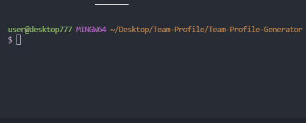
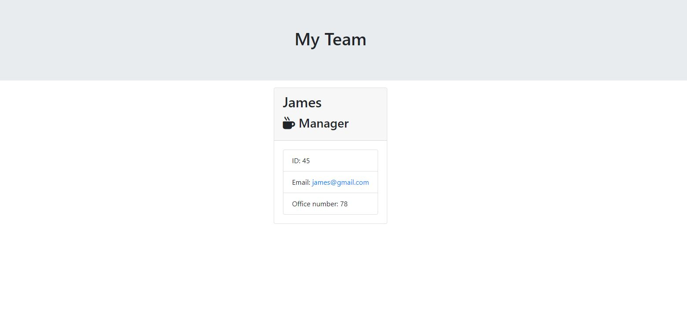

# Team-Profile

## SE-Team-Generator

Description
This Project consists of CLI application that generate an HTML profile Team after user has respond to prompted questions.

## Table of Contents

Installation
Usage
Screenshots
Credits

Installation

## Steps to install application:

1 . Clone repository.
2 . In the directory with app.js run npm install
3 . Start server and answer prompts
4 . HTML Generated with all the team member profile

## Cloning the Repo

git@github.com:Farouk994/Team-Profile-Generator.git
npm install
node app.js

## cUsage

Screenshots
Working app

## Technologies Used
Javascript
https://img.shields.io/badge/JavaScript-323330?style=for-the-badge&logo=javascript&logoColor=F7DF1E

NPM library

Expressjs

